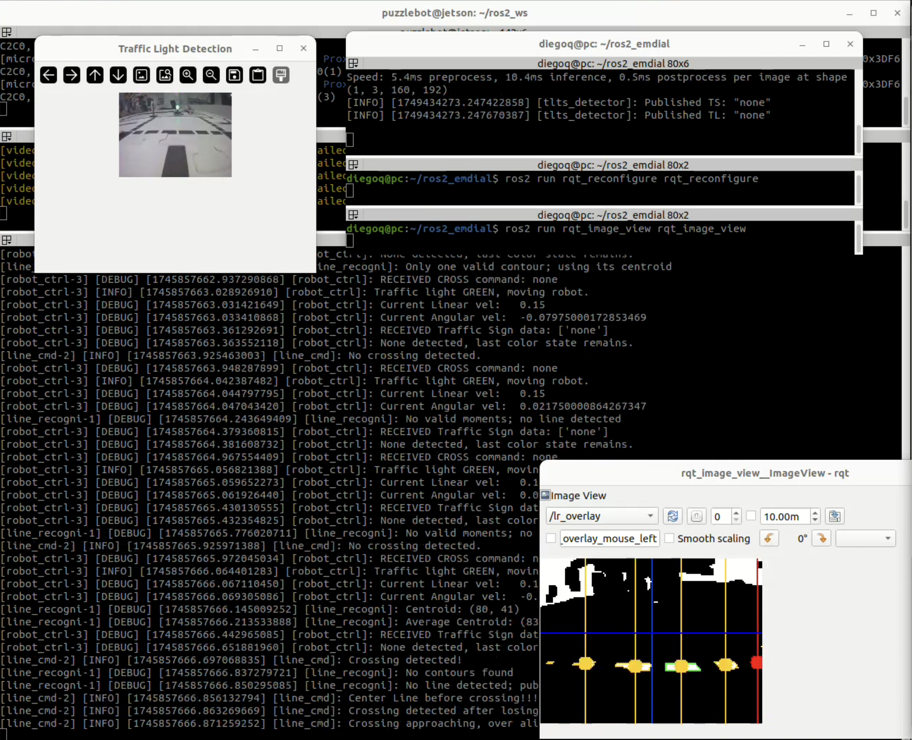

# Puzzlebot Emdial Guide

Usage and Installation Guide.  
For ***v1.2.1 Release***. June 14, 2025  
Developed by *Team Emdial*.

## Index

- [Puzzlebot Emdial Guide](#puzzlebot-emdial-guide)
  - [Index](#index)
  - [v1.2.1 Release Contents](#v121-release-contents)
  - [Requirements for any package in the repository](#requirements-for-any-package-in-the-repository)
  - [Local machine Installation](#local-machine-installation)
    - [Installing the *puzzlebot\_emdial **package*** from ***Repo as WS***](#installing-the-puzzlebot_emdial-package-from-repo-as-ws)
  - [Puzzlebot Installation](#puzzlebot-installation)
    - [Installing the *puzzlebot\_emdial **package*** in the Puzzlebot](#installing-the-puzzlebot_emdial-package-in-the-puzzlebot)
    - [Launching in ONBOARD MODE (Recommended)](#launching-in-onboard-mode-recommended)
      - [Launching Nodes for Local Machine](#launching-nodes-for-local-machine)
      - [Launching Nodes directly on the Puzzlebot](#launching-nodes-directly-on-the-puzzlebot)
    - [Launching in REMOTE MODE](#launching-in-remote-mode)
    - [Launching in SIMULATION MODE](#launching-in-simulation-mode)
    - [Execution Examples (Screenshots)](#execution-examples-screenshots)
  - [Known Issues](#known-issues)
  - [License](#license)
  - [Acknowledgements](#acknowledgements)

## v1.2.1 Release Contents

The *puzzlebot_emdial **repository*** contains all packages developed for each Minichallenge, final challenge and extra tools. The repository is structured as follows:

Where the Final Challenge package is named `puzzlebot_emdial` inside the `src` folder.

``` txt
puzzlebot_emdial/
├── src/
│   ├── mc1_opencontrol/
│   ├── mc2_motioncontrol/
│   ├── mcHT_traffic_light/
│   ├── line_follower/
│   ├── puzzlebot_emdial/
│   ├── toolbox_pkg/
│   ├── webcam_pub/
│   ├── mobile_robotics/
│   ├── puzzlebot_description/
│   └── puzzlebot_gazebo/
├── train/
├── data/
├── models/
├── extra/
├── .gitignore
├── manual_ejecucion.md
├── README.md
├── LICENSE
├── requirements.txt
├── mod1_requirements.txt
└── modA_requirements.txt
```

## Requirements for any package in the repository

To run any package in the *`puzzlebot_emdial` **repository***, you need to have the following prerequisites:

1. **ROS2 Humble**:
   Ensure you have ROS2 Humble installed on your system. You can follow the official [Installation guide](https://docs.ros.org/en/humble/Installation.html).

2. **Python 3.10**:
   The packages in this repository are compatible with Python 3.10. Make sure you have it installed. (other versions may work, but they are not tested)

3. **Ubuntu 22.04**:
   The packages are developed and tested on Ubuntu 22.04. While they may work on other versions, it is recommended to use Ubuntu 22.04 for compatibility. Any architecture is supported.

## Local machine Installation

### Installing the *puzzlebot_emdial **package*** from ***Repo as WS***

To **Install** the *`puzzlebot_emdial` **package***, follow these steps:

1. **Obtain the source files**:

    - **Download Release (Recommended)**:

        Download the latest release from the [Releases page](https://github.com/aldrick-t/puzzlebot-emdial/releases).

        - Extract the downloaded archive to a directory of your choice. This will create a folder named `puzzlebot_emdial` containing ALL the source files.

    - **OR clone the repository**:

        If you prefer to clone the repository, you can do so with the following command:

        ```bash
        git clone
        ```

        > Make sure to select the correct branch/tag for the latest version (see version in the [Title](#puzzlebot-emdial-guide) of this document).

2. **Navigate to the Repository/Workspace directory**:

   ```bash
   cd puzzlebot_emdial/
   ```

3. **Install dependencies**:

    Make sure you have the required Python dependencies installed. You can use the provided `modA_requirements.txt` files:

    ```bash
    pip install -r ../../modA_requirements.txt
    ```

    > **Why modA_requirements.txt?**
    >
    > The `modA_requirements.txt` file contains the necessary dependencies without extra noise created by the `pip freeze` command within a ROS2 environment. In other words, its a version of the `requirements.txt` file thats ready to run with pip install to avoid errors.
    >
    > If you are still encontering errors **or want to avoid any potential issues with your ROS2 installation**, try to manually install the dependencies listed in the `requirements.txt` file.

4. **Source the ROS2 environment**:

   Make sure to source your ROS2 environment. If you are using a standard ROS2 installation, you can do this with:

   ```bash
   source /opt/ros/humble/setup.bash
   ```

5. **Build the workspace**:

   If you are using a workspace, build it with:

   ```bash
   colcon build
   ```

   Or specifically for the *`puzzlebot_emdial` **package***:

   ```bash
    colcon build --packages-select puzzlebot_emdial
    ```

6. **Source the workspace**:
    After building, source the workspace to make the packages available:

    ```bash
    source install/setup.bash
    ```

### Installing the *puzzlebot_emdial **package*** as a Package in an existing WS

If you already have a suitable ROS2 workspace and want to add the *`puzzlebot_emdial` **package*** to it, follow these steps:

1. **Navigate to your existing workspace**:

   ```bash
   cd /path/to/your/existing/workspace/
   ```

2. **Clone/Paste the *`puzzlebot_emdial` package***:

   - If you downloaded the release or cloned the repository, copy the *`puzzlebot_emdial` **package*** folder (inside `src`) to your existing workspace's `src` directory.

3. Follow steps 3 to 6 from the previous section ([Installing the *puzzlebot_emdial **package*** from ***Repo as WS***](#installing-the-puzzlebot_emdial-package-from-repo-as-ws)) to install dependencies, build the workspace, and source it.

## Puzzlebot Installation

To run the Final Challenge package, it also needs to exist within the `src` folder of a ros2 workspace within the Puzzlebot.

### Installing the *puzzlebot_emdial **package*** in the Puzzlebot

1. **Remotely connect to the Puzzlebot**:

   Use SSH or any other remote connection method to access the Puzzlebot directories.

2. **Navigate to the Puzzlebot's ROS2 workspace Directory**:

    The usual path for the Puzzlebot's ROS2 workspace `src` folder is:

   ```bash
   cd /home/ros2_ws/src/
   ```

3. **Paste the *`puzzlebot_emdial` package***:

    Copy the *`puzzlebot_emdial` **package*** folder (inside `src`) to the Puzzlebot's ROs2 workspace's `src` directory.

4. **Install dependencies**:

   Installation and running on the Puzzlebot should work with the native Python 3.10 ROS2 environment preinstalled on the Puzzlebot (when flashing the image).

5. **Build the workspace**:

   If you are using a workspace, build it with:

   ```bash
   colcon build
   ```

   Or specifically for the *`puzzlebot_emdial` **package***:

   ```bash
    colcon build --packages-select puzzlebot_emdial
    ```

6. **Source the workspace**:

    After building, source the workspace to make the packages available:

    ```bash
    source install/setup.bash
    ```

## Executing the *puzzlebot_emdial **package***

Prior to executing any of the launch modes, make sure you have sourced the workspace where the *`puzzlebot_emdial` **package*** is installed. This can be done by running the following when inside your workspace directory:

```bash
source /install/setup.bash
```

>**Important**: In ANY mode, it is **NECESSARY** to activate the System with a live parameter change. Its **HIGHLY RECOMMENDED**  to use `rqt_reconfigure`:
>
>```bash
>ros2 run rqt_reconfigure rqt_reconfigure
>```
>
> This tool allows the user to change the `ctrl_activate` parameter to `true` in the `robot_ctrl` node, which is necessary for the Puzzlebot to start moving.
>
> If you do not use `rqt_reconfigure`, you can also change the parameter manually using the following command (not tested):
>
>```bash
>ros2 param set /robot_ctrl ctrl_activate true
>```
>
> Also, many parameters can be changed for all nodes in the package using `rqt_reconfigure` to play around and test different configurations, the base configurations are presaved in the `config` folder of the package and loaded each time when the package is launched.

### Launching in ONBOARD MODE (Recommended)

Running some nodes onboard the Puzzlebot and others on a local machine is the recommended way to run the *`puzzlebot_emdial` **package***.

The launch files can be run in **any order**, but it is recommended to run the Puzzlebot Launch first, and then the local machine Launch.

#### Launching Nodes for Local Machine

To run the package nodes that MUST run outside the Puzzlebot, use the following command:

```bash
ros2 launch puzzlebot_emdial emdial_loc_launch.py
```

#### Launching Nodes directly on the Puzzlebot

To run the package nodes that MUST run on the Puzzlebot, use the following command:

```bash
ros2 launch puzzlebot_emdial emdial_onb_launch.py
```

### Launching in REMOTE MODE

Running all nodes on the local machine (remotely from the Puzzlebot) is not recommended, but it can be done if you want to test the package without the hassle of installing it on the Puzzlebot.

To run the package nodes remotely, use the following command:

```bash
ros2 launch puzzlebot_emdial emdial_rem_launch.py
```

### Launching in SIMULATION MODE

Running the package in simulation mode is useful for testing and development purposes. Gazebo Sim *Fortress* or *Garden* is a requirement for this mode.

To run the *`puzzlebot_emdial` **package*** in simulation mode, use the following command:

```bash
ros2 launch puzzlebot_emdial emdial_sim_launch.py
```

For Simulation mode, you need to have the `puzzlebot_gazebo` package installed and sourced in your workspace as well as the `puzzlebot_description` package.

If all prerequisites are met, this command will launch the Gazebo simulation environment with the Puzzlebot model in a testing environment.

```bash
ros2 launch puzzlebot_gazebo gazebo_example_launch.py
```

> **Note**: If you are running Ubuntu with a ARM64 architecture, make sure the `aldrick=` flag is set to `true` in the `gazebo_example_launch.py` file. This will ensure that the simulation runs correctly and accuratly on arm64 machines.

### Execution Examples (Screenshots)

Some examples of the package running in ONBOARD MODE.




## Known Issues

See the [Issues page](https://github.com/aldrick-t/puzzlebot-emdial/issues) on GitHub for known issues and troubleshooting.

Open an issue if you find a bug or have a feature request. The team will review it and respond as soon as possible.

## License

This project is licensed under the MIT License. See the [LICENSE](LICENSE) file for details.

## Acknowledgements

This project is developed by *Team Emdial* in solution of the *Puzzlebot Challenge by MCR2*.

Team Emdial, 2025  

@aldrick-t  
@diegoquezadaco  
@EmanuelVegaGlz
